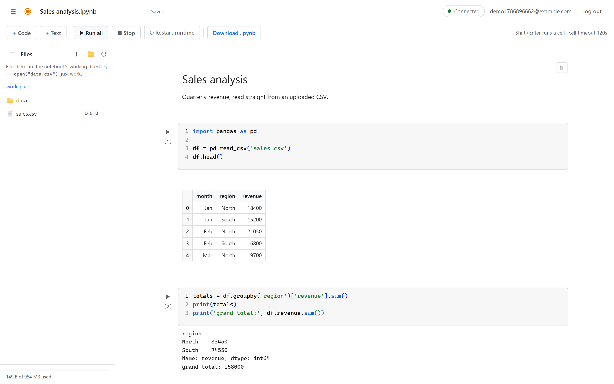
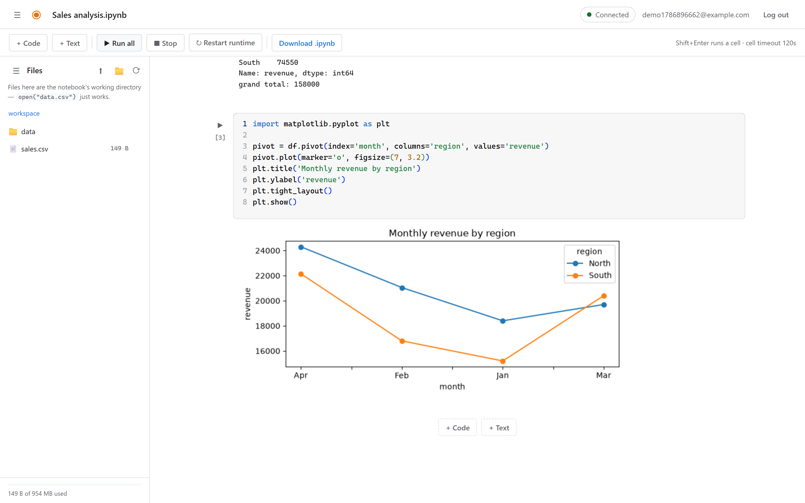
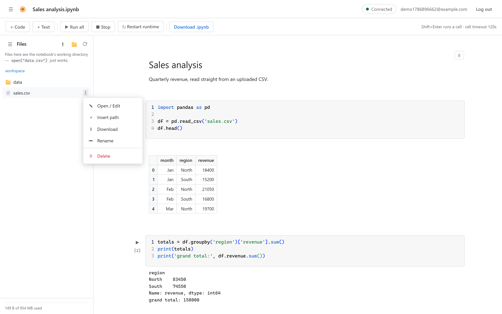
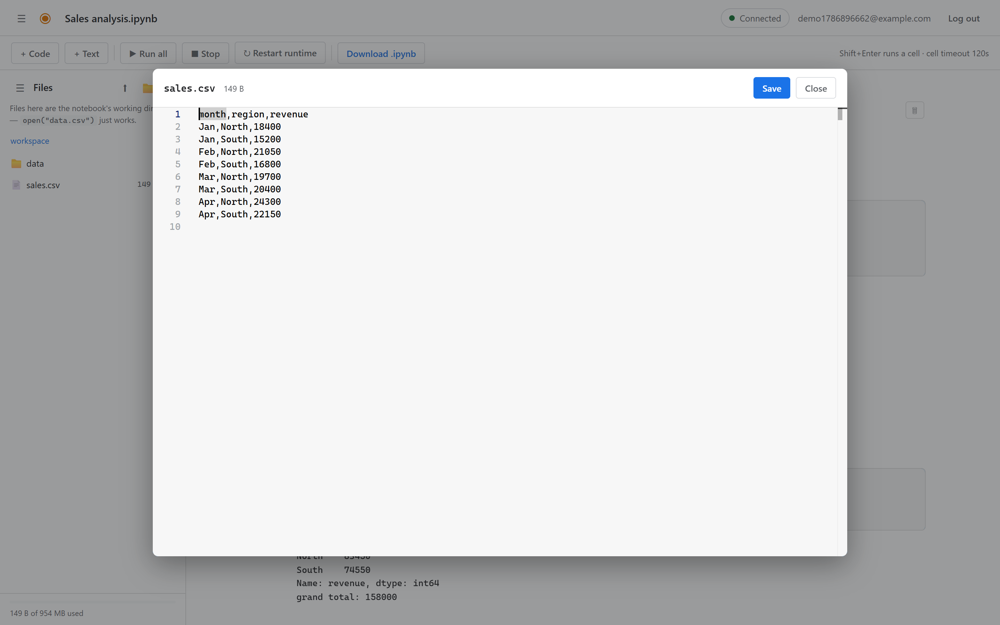
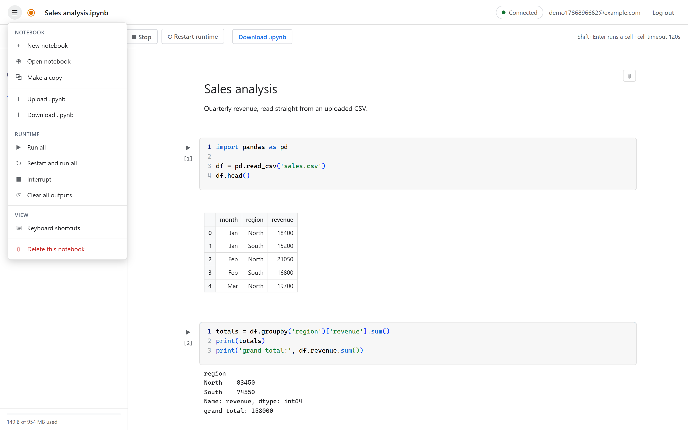
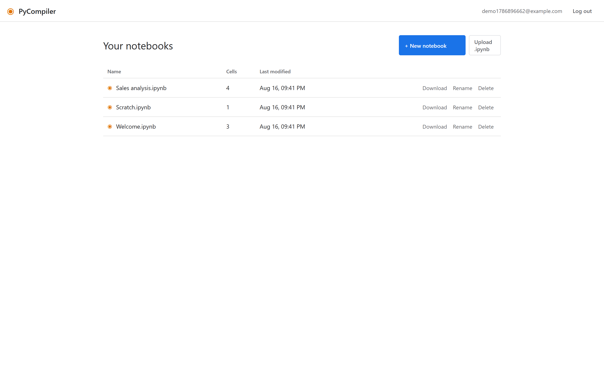
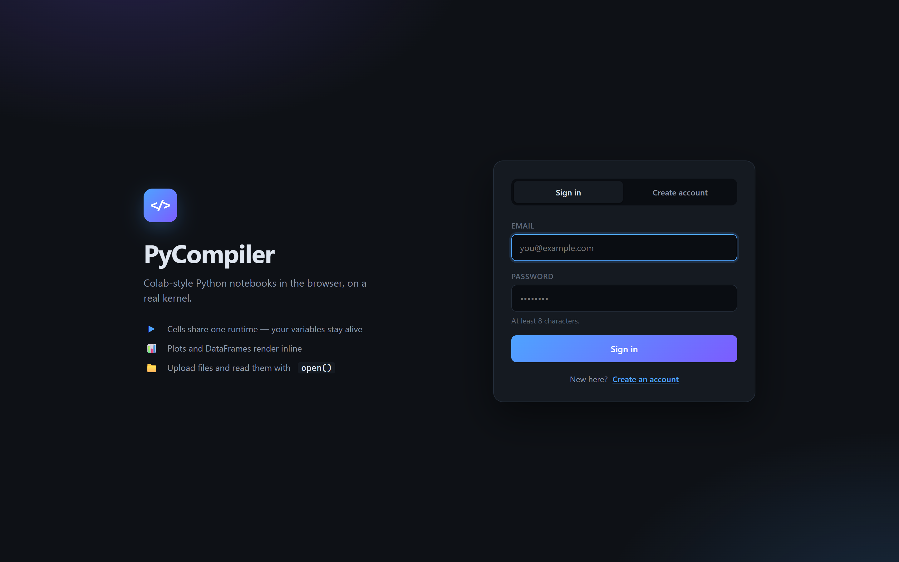

# Python Learning Platform

A Colab-style Python notebook that runs in your browser, backed by a **real IPython
kernel** — so variables persist between cells, plots render inline, and `input()` works.



FastAPI + SQLite on the back end, Monaco (the VS Code editor) on the front end, and one
live kernel per user driven over a WebSocket. No cloud services, no accounts anywhere but
your own machine.

---

## What it does

### Cells share one runtime

Define `df` in one cell and it's still there five cells later, exactly like Colab. Output
streams in as it's produced, so a long loop prints as it goes instead of dumping at the end.



matplotlib figures come back as inline PNGs, pandas DataFrames as HTML tables, and
tracebacks land in a red box pointing at the offending line.

### Your own file workspace

The **Files** panel *is* the kernel's working directory, so an uploaded `sales.csv` is
readable immediately with `pd.read_csv("sales.csv")` — no paths to work out.



Upload with the button or by dragging files onto the panel. Every entry has a `⋮` menu:
**Open / Edit · Insert path · Download · Rename · Delete**.

### Files open for real

Click a file to open it. Text files edit in Monaco and save straight back to disk with
`Ctrl+S` — the kernel sees the change on the next line you run. Images preview inline;
binaries and anything over 2 MB say so instead of flooding the browser.



### Everything from one menu



New notebook · Open notebook (the list loads on demand) · Make a copy · Upload/Download
`.ipynb` · Run all · Restart and run all · Interrupt · Clear all outputs · Keyboard
shortcuts · Delete this notebook.

### Notebooks and sign-in

| | |
|---|---|
|  |  |

Email + password with bcrypt hashes and a JWT in an HttpOnly cookie. Every notebook, cell,
run and file is scoped to its owner.

---

## Assignment & review platform

The same install doubles as a **Python code assignment and review platform**. An account is
either a **trainer** or a **student** (chosen when you register), and each role signs in to
its own dashboard.

### Trainer dashboard — `/trainer`

Total students, coding exercises (published vs draft), pending submissions, submissions
awaiting review, and completed work, each card jumping to the panel behind it. Below that:
the review queue, outstanding assignments with overdue flags, upcoming deadlines with a
submitted/assigned bar, per-student progress, the exercise list, notifications and a recent
activity feed.

**New exercise** creates a coding exercise — title, problem statement, input/output format,
samples, constraints, due date, draft or published — with any number of test cases (each one
public or hidden), and assigns it to the students you pick. They are notified immediately.

**Review** opens a submission: the student's code, its verdict, how many test cases passed,
and a comment box. Approve it, or request modifications and it reopens on the student's side.

### Student dashboard — `/student`

A **continue where you left off** card resumes the most recently opened piece of open work,
then counts for assigned / in progress / awaiting review / changes requested / completed,
each one filtering the list below. Every exercise shows its status, due date (overdue in red),
last verdict, test tally, and any trainer feedback inline.

**Start** opens the exercise as a notebook — the problem statement rendered as markdown, the
starter code in a cell — so the whole notebook runtime above is the editor. **Submit** runs
the solution against every test case, hidden ones included, and records the verdict
(Accepted, Wrong Answer, Runtime Error, Syntax Error). Resubmit until the trainer approves.

### Learning modules — `/trainer/modules`, `/student/modules`

A trainer uploads a module as a single `.ipynb`. It is flattened once, on
upload, into an ordered lesson: **markdown cells become the text, code cells
become practice sections**. Nothing is assembled item by item in the website.

The student player renders those blocks in order and gives every code section
its own editor, a **Run** button and an output pane, so a topic is followed
immediately by practice — the way w3schools reads.

Progress is evidence rather than self-assessment: a practice section counts
once the student has run it without raising, so a module's percentage reflects
the code they actually got working. Trainers see the same number per student
on the module page and on each student's detail page.

Each run is a fresh, isolated subprocess with a short timeout, so one
learner's runaway `while True` cannot affect anything else.

### Demo data

```powershell
.\.venv\Scripts\python.exe -m app.seed
```

Creates a trainer, four students, four exercises and a spread of assignments, submissions and
feedback, so both dashboards open with real content. `--reset` recreates it.

| Role | Email | Password |
|---|---|---|
| Trainer | `trainer@pycompiler.dev` | `trainer1234` |
| Student | `aditi@pycompiler.dev` (and `rahul@`, `meera@`, `karthik@`) | `student1234` |

---

## Feature list

- **Live kernel per user** — state persists across cells; an idle kernel is reaped after 30 minutes
- **Streaming execution** over WebSocket, with **Stop** (interrupt) and **Restart runtime**
- **`input()`** — the kernel's prompt round-trips to an inline box in the cell
- **Rich output** — inline PNGs, HTML tables, SVG, `display()`, markdown
- **Code and text cells** — markdown renders on click-away, `[1] [2]` execution counts
- **Run all** — top to bottom, halting at the first error, as Jupyter and Colab do
- **`.ipynb` import/export** — round-trips with real Colab and Jupyter
- **File workspace** — upload, browse, folders, open/edit/save, rename, download, delete, quota bar
- **Outputs are stored** — a page reload shows your results again, and the kernel outlives
  the reload, so your variables are still there
- **Cache-busted assets**, sticky toolbar, resizable panels, toasts, keyboard shortcuts
- **Two portals** — trainers and students sign in to their own role-scoped dashboard
- **Exercise authoring** — statement, formats, samples, constraints, due date, draft/published
- **Public and hidden test cases** — hidden ones count towards the verdict, never shown
- **Automatic evaluation** on submit: Accepted, Wrong Answer, Runtime Error, Syntax Error
- **Review loop** — approve or request modifications, with comments the student sees inline
- **Progress tracking and notifications** for both roles, plus per-user activity feeds

---

## Quick start

```powershell
git clone https://github.com/ranjith-005/python_compiler.git
cd python_compiler
.\run.ps1
```

`run.ps1` creates the virtual environment and installs dependencies on first run, then
serves on <http://127.0.0.1:8000>. Open it, create an account — as a **student** or a
**trainer** — and start writing Python. To look around with data already in place, seed the
[demo accounts](#demo-data) first.

Or just double-click **`start.bat`**, which opens your browser and starts the server.
**`stop.ps1`** stops whatever is listening on port 8000.

Requires **Python 3.11+** (developed on 3.12). The SQLite database, a generated
`SECRET_KEY` in `.env`, and your workspace folder are all created automatically.

### Keyboard shortcuts

| Shortcut | Action |
|---|---|
| `Shift + Enter` | Run cell, then select the next one |
| `Ctrl + Enter` | Run cell and stay on it |
| `Ctrl + S` | Save the file open in the file editor |
| `Esc` | Close a menu or dialog |

---

## Configuration

Copy `.env.example` to `.env` and edit what you need — cell timeout, upload limits, session
length, and where the database and workspaces live. Defaults are sensible; the only value
that matters for security is `SECRET_KEY`, which is generated for you on first start.

---

## Tests

```powershell
.\.venv\Scripts\python.exe -m pytest
```

84 tests covering the kernel (state across cells, tracebacks, inline PNG, pandas HTML,
stdin, cell timeout + interrupt, restart clearing state), the WebSocket (streaming, output
persistence, `input()` round-trip, cross-user rejection), the notebook API (CRUD, reorder,
duplicate, clear-outputs, ownership isolation, `.ipynb` round-trip), the file manager
(upload/open/edit/download/delete, folders, quota, per-user isolation, path-traversal
attempts such as `../../escape.txt` and `C:\Windows\...`), auth, and the dashboards
(role routing and 403s both ways, overview counts, per-trainer and per-student isolation,
assignment -> notebook -> submit -> evaluate -> review -> feedback end to end, resubmission
superseding the queued attempt, and notifications).

Two scripts run against a **live** server (start it in another terminal first):

```powershell
pip install -r dev-requirements.txt
.\.venv\Scripts\python.exe tests\ui_notebook_check.py .\shots        # 78 browser checks
.\.venv\Scripts\python.exe tests\capture_screenshots.py docs\screenshots
```

The first drives your installed Chrome headlessly through the whole UI; the second
regenerates the screenshots in this README.

---

## ⚠ Security boundary

**Code in a cell — and a submitted solution being evaluated — runs as a normal process
under your OS account.** There are *resource*
limits — a cell timeout, an output cap, one kernel per user with an idle reaper and a cap
on live kernels — but this is **not a security sandbox**. A cell can read and write your
files and open network connections, and the kernel holds state between requests.

So: it binds to `127.0.0.1` by default, and it is meant for a single trusted user on their
own machine. **Do not expose it to the internet as-is.** To harden it, launch each user's
kernel inside a container and point the kernelspec written by `app/kernel.py` at that
container instead of the local interpreter.

Uploads are handled carefully regardless: every path from a request goes through one
`resolve_within` guard, uploaded names are reduced to a safe basename, and only images are
ever served inline (with `nosniff` and a sandbox CSP) so an uploaded `.html` or `.svg`
can't execute on the app's origin.

---

## Project layout

```
app/
  main.py       FastAPI app; pages: / · /login · /trainer · /student · /notebooks · /nb/{id}
  config.py     settings, read from .env with defaults
  db.py         SQLite schema and connection
  security.py   bcrypt hashing, JWT session cookies
  deps.py       current-user dependency, trainer/student role guards
  auth.py       /auth/register · /login · /logout · /me

  dashboards.py /api/dashboard — trainer and student overview aggregation
  assignments.py/api/exercises · /api/assignments · /api/submissions — assign,
                open, submit, auto-evaluate, review
  seed.py       demo trainer, students, exercises and submissions

  kernel.py     KernelSession / KernelRegistry — one IPython kernel per user
  ws.py         /ws/kernel/{id} — streaming execution, interrupt, restart, input()
  notebooks.py  /api/notebooks — CRUD, cells, reorder, duplicate, .ipynb import/export
  workspace.py  per-user folder + path-traversal defence
  files.py      /api/files — upload, browse, open/save, download, rename, delete

  templates/    base · login · notebooks · notebook · trainer_dashboard · student_dashboard
  static/       css/{colab,styles,dashboard}.css
                js/{notebook,notebooks_home,auth,dashboard_common}.js
                js/{trainer,student}_dashboard.js

tests/          test_kernel · test_ws · test_notebooks · test_files · test_auth
                test_dashboards · ui_notebook_check.py · capture_screenshots.py

run.ps1 · start.bat · stop.ps1 · requirements.txt · dev-requirements.txt · .env.example
```

Created at runtime and git-ignored: `.venv/`, `pycompiler.db`, `workspaces/user_<id>/`
(each kernel's working directory), `.kernels/` (a kernelspec pinned to the venv), and
`server.log`.

Interactive API docs are at `/docs` while the server is running.
